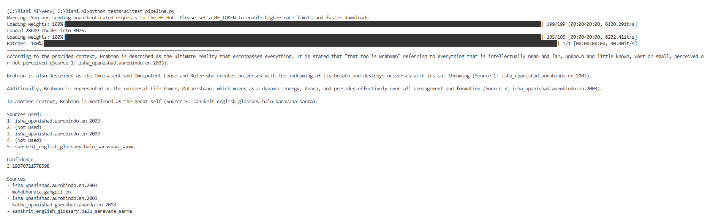

# Changelog

All notable changes to this project will be documented in this file.

---

# v0.3.1

## ✨ Highlights

This release improves the readability and presentation of Rishi AI responses.

### Added

- Response formatter for terminal output
- Human-readable source names
- Source deduplication
- Improved prompt structure
- Better formatted AI responses

### Improved

- Cleaner response layout
- More consistent answer structure
- Better citation presentation

---

# v0.3.0

## 🚀 First End-to-End AI Pipeline

Rishi AI generated its first grounded answer using the complete RAG pipeline.

  

## 🎉 Major Milestone

Rishi AI successfully generated its first grounded response using
its complete Retrieval-Augmented Generation pipeline.

This marks the transition from an infrastructure project to a
functional AI knowledge engine.
s
### Highlights

- ✅ Prompt Builder
- ✅ Groq Integration
- ✅ Hybrid Retrieval
- ✅ Cross Encoder Reranking
- ✅ Citation Support
- ✅ First Grounded Response

## Technical Pipeline

Question

↓
SentenceTransformer

↓
Chroma Vector Search

↓
BM25 Retrieval

↓
Reciprocal Rank Fusion

↓
Cross Encoder Reranking

↓
Prompt Builder

↓
Groq

↓
Grounded Answer

↓
Citations

---
## [0.2.5] - 2026-06-29

### Added
- Implemented Semantic Chunking strategy.
- Added sentence-based semantic segmentation using embeddings.
- Added cosine similarity boundary detection.
- Added semantic chunk construction pipeline.
- Added smoke tests for semantic chunking.
- Added configurable similarity threshold for semantic segmentation.

### Improved
- Refined chunking architecture with modular helper methods.
- Reused the common `Chunk` domain model across chunking strategies.

---

## [v0.2.4] - 2026-06-29

### ✨ Added

* Added a complete retrieval evaluation framework.
* Implemented `Precision@K` for measuring retrieval accuracy.
* Implemented `Recall@K` for measuring retrieval coverage.
* Implemented `Reciprocal Rank` for ranking quality evaluation.
* Added `Evaluator` for evaluating individual retrieval queries.
* Added `Benchmark` for running evaluation suites over multiple queries.
* Introduced `BaseRetriever` abstract interface to standardize retrieval implementations.
* Added `BenchmarkResult` and evaluation data models.

### 🧪 Testing

* Added smoke tests for the complete benchmarking pipeline.
* Verified end-to-end integration of retrieval, evaluation, and benchmarking components.

### 🛠️ Improvements

* Refactored retrieval architecture to use a common retriever interface.
* Improved recall calculation by counting unique retrieved documents.
* Added comprehensive documentation, comments, and type hints across the evaluation module.

---

## v0.2.3

### ✨ Added

- Introduced `BaseOCR` abstraction.
- Added `RapidOCRProcessor` implementation.
- Integrated OCR fallback into the PDF ingestion pipeline.
- Added support for extracting text from scanned PDFs.

### 🏗️ Improvements

- OCR is now decoupled from document ingestion through dependency inversion.
- Native PDF text extraction remains the primary path, with OCR used only when needed.
- Improved resource management using context managers for PDF handling.

### 🧪 Testing

- Verified OCR extraction on a 614-page scanned edition of the Brahma Sutras (1936).

---

## v0.2.2

### ✨ Added

- CrossEncoderReranker for retrieval reranking
- BaseReranker abstraction
- Integration of reranking into HybridRetriever

### 🧪 Testing

- Added end-to-end reranking smoke test

### 🏗️ Improvements

- Retrieval pipeline now supports optional reranking
- Improved modular retrieval architecture

---

## v0.2.1

### ✨ Added

- RecursiveChunker with hierarchical text splitting
- ChapterChunker for chapter-aware document chunking

### 🧪 Testing

- Added smoke tests for RecursiveChunker
- Added smoke tests for ChapterChunker

### 🏗️ Improvements

- Improved chunking architecture with reusable helper methods
- Better separation of chunking strategies

---

## [0.2.0] - 2026-06-25

### Added
- BM25 lexical retrieval
- Query preprocessing with NLTK stopword removal
- Reciprocal Rank Fusion (RRF)
- HybridRetriever
- Metadata-aware Chroma retrieval
- Manual smoke tests

### Improved
- Query model with metadata filters
- Chroma vector store
- Documentation and comments

---

## [0.1.0] - 2026-06-20

### Added
- PDF ingestion pipeline
- Document cleaning
- Fixed-size chunking
- Sentence Transformer embeddings
- ChromaDB indexing
- Semantic retrieval

## v0.1.1 - Phase 1 Foundation

### Repository
- Established scalable project architecture.
- Organized modules into app/, scripts/, storage/, config/, tests/.

### Corpus
- Designed corpus folder hierarchy.
- Added metadata schema.
- Added corpus manifest generation.

### Ingestion
- Implemented PDF extraction using PyMuPDF.
- Added ingestion pipeline.
- Added document manifest validation.
- Added processed corpus generation.

### Cleaning
- Introduced CleaningPipeline.
- Added BaseCleaner abstraction.
- Added UnicodeNormalizer.
- Added WhitespaceCleaner.

### Chunking
- Introduced BaseChunker abstraction.
- Added Chunk model.
- Added FixedChunker.
- Added ChunkingPipeline.

### Embeddings
- Introduced embedding pipeline architecture.
- Added SentenceTransformerEmbedder.

### Vector Database
- Added ChromaDB integration scaffold.

### Misc
- Improved project package structure.
- Added domain models.
- Added unit tests for metadata, extraction, cleaning and chunking.